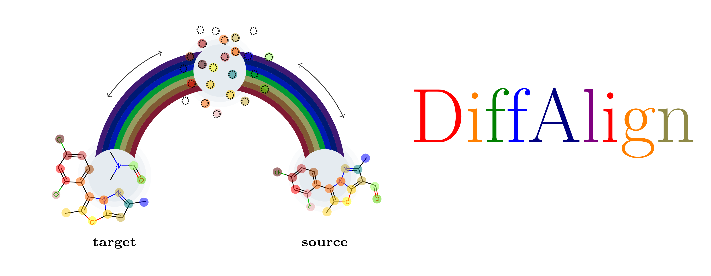

<div align="center">
	
    <h3><i>DiffAlign</i></h3>

This the official implementation of the DiffAlign model as seen in [Equivariant Denoisers Cannot Copy Graphs: Align Your Graph Diffusion Models](https://openreview.net/forum?id=onIro14tHv&referrer=%5Bthe%20profile%20of%20Najwa%20Laabid%5D(%2Fprofile%3Fid%3D~Najwa_Laabid1))

## Obtaining processed data and checkpoints
The processed data can be downloaded from [this link](https://figshare.com/articles/dataset/Processed_USPTO-50k_data_as_graphs_for_DiffAlign/30787127?file=60100430). The checkpoint for our best model (aligned with absorbing transition) can be found [here](https://figshare.com/articles/online_resource/DiffAlign_aligned_absorbing_state_checkpoint/30787181).

## Training the model
To train our best model, run the following command:
```
python3 scripts/train.py +experiment=align_absorbing
```

## Generating samples
Run the following script to generate samples similar to the ones used in the results (Table ...).
´your_experiment_name´ is the name of the experiment where you want to save the samples.
Alternatively, you can obtain the exact samples used in the paper in this link. 
```
python3 src/sample_array_job.py
		 +experiment=7ck
		 general.wandb.mode=offline
		 general.wandb.run_id=7ckmnkvc
		 diffusion.edge_conditional_set=test
		 general.wandb.checkpoint_epochs=[720]
		 test.condition_first=0
		 test.condition_index=0
		 test.n_conditions=5000
		 test.n_samples_per_condition=100
		 dataset.shuffle=False
		 dataset.dataset_nb=uspto50k
		 general.wandb.load_run_config=True
		 hydra.run.dir=../experiments/your_experiment_name/
		 test.total_cond_eval=5000
		 train.seed=329
		 diffusion.diffusion_steps=100
		 diffusion.diffusion_steps_eval=100
		 dataset.add_supernode_edges=True
		 dataset.num_workers=0
```

## Evaluating samples
To evaluate samples, run the following command. Make sure ´your_experiment_name´ is the name of the experiment where you saved the samples earlier.
```
python3 src/evaluate_array_job.py
		 +experiment=7ck
		 general.wandb.mode=offline
		 general.wandb.run_id=7ckmnkvc
		 diffusion.edge_conditional_set=test
		 general.wandb.checkpoint_epochs=[720]
		 test.condition_first=0
		 test.condition_index=0
		 test.n_conditions=5000
		 test.n_samples_per_condition=100
		 dataset.shuffle=False
		 dataset.dataset_nb=uspto50k
		 general.wandb.load_run_config=True
		 hydra.run.dir=../experiments/your_experiment_name/
		 test.total_cond_eval=5000
		 train.seed=329
		 diffusion.diffusion_steps=100
		 diffusion.diffusion_steps_eval=100
		 dataset.add_supernode_edges=True
		 dataset.num_workers=0
```

## Citation
```
@inproceedings{
laabid2025equivariant,
title={Equivariant Denoisers Cannot Copy Graphs: Align Your Graph Diffusion Models},
author={Najwa Laabid and Severi Rissanen and Markus Heinonen and Arno Solin and Vikas Garg},
booktitle={The Thirteenth International Conference on Learning Representations},
year={2025},
url={https://openreview.net/forum?id=onIro14tHv}
}
```