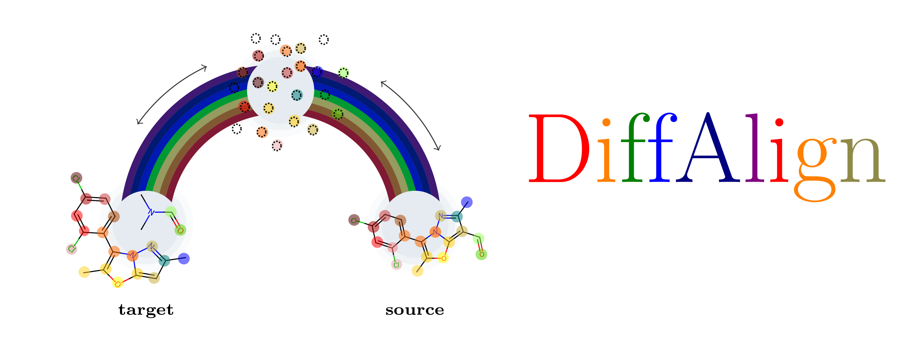

<div style="clear: both;"></div>

This the official implementation of the DiffAlign model as seen in <a href="https://openreview.net/forum?id=onIro14tHv">Equivariant Denoisers Cannot Copy Graphs: Align Your Graph Diffusion Models</a>

## Installation

```bash
conda activate diffalign-10
pip install -e .
```

## Obtaining processed data and checkpoints
The processed data can be downloaded from [this link](https://figshare.com/articles/dataset/Processed_USPTO-50k_data_as_graphs_for_DiffAlign/30787127?file=60100430). The checkpoint for our best model (aligned with absorbing transition) can be found [here](https://figshare.com/articles/online_resource/DiffAlign_aligned_absorbing_state_checkpoint/30787181).

## Training the model
To train our best model, run the following command:
```bash
python scripts/train.py +experiment=align_absorbing
```

## Generating samples
```bash
python scripts/sample.py \
    +experiment=align_absorbing \
    general.wandb.mode=offline \
    general.wandb.run_id=YOUR_RUN_ID \
    general.wandb.checkpoint_epochs=[720] \
    test.n_conditions=5000 \
    test.n_samples_per_condition=100 \
    diffusion.diffusion_steps_eval=100 \
    hydra.run.dir=../experiments/YOUR_EXPERIMENT_NAME/
```

## Evaluating samples
```bash
python scripts/evaluate.py \
    +experiment=align_absorbing \
    general.wandb.mode=offline \
    general.wandb.run_id=YOUR_RUN_ID \
    general.wandb.checkpoint_epochs=[720] \
    test.n_conditions=5000 \
    test.n_samples_per_condition=100 \
    diffusion.diffusion_steps_eval=100 \
    hydra.run.dir=../experiments/YOUR_EXPERIMENT_NAME/
```

## Code structure

```
DiffAlign/
    diffalign/
        __init__.py             # Public API: DiffAlignModel, predict_precursors
        constants.py            # Centralized constants (MAX_ATOMS_RXN, BOND_TYPES, etc.)
        inference.py            # Core inference pipeline (model loading, prediction)
        model.py                # Syntheseus adapter (DiffAlignModel)
        diffusion/
            diffusion_abstract.py   # Base diffusion model class
            diffusion_rxn.py        # Reaction-specific diffusion (training, eval, scoring)
            elbo.py                 # ELBO computation mixin
            sampling.py             # Sampling mixin
            noise_schedule.py       # Noise schedule / transition matrices
        datasets/
            supernode_dataset.py    # USPTO-50k reaction dataset with supernodes
        neuralnet/
            transformer_model_with_y.py  # Graph transformer architectures
            layers.py                    # Transformer layers
            extra_features.py            # Extra graph features
        utils/
            graph.py              # Graph utilities, dense conversion, masking
            graph_builder.py      # Shared reaction graph construction
            placeholder.py        # PlaceHolder data class
            mol.py                # Molecule/reaction SMILES utilities
            setup.py              # Model & dataset setup, wandb integration
    scripts/
        train.py        # Training entry point
        sample.py       # Sampling entry point
        evaluate.py     # Evaluation entry point
    api/
        predict.py      # Web API (thin re-export from diffalign.inference)
    configs/
        experiment/     # Experiment configs (align_absorbing.yaml, align_marginal.yaml)
    tests/
        test_smoke.py           # Import and config smoke tests
        test_graph_builder.py   # Graph builder regression tests
```

## Citation
```
@inproceedings{
laabid2025equivariant,
title={Equivariant Denoisers Cannot Copy Graphs: Align Your Graph Diffusion Models},
author={Najwa Laabid and Severi Rissanen and Markus Heinonen and Arno Solin and Vikas Garg},
booktitle={The Thirteenth International Conference on Learning Representations},
year={2025},
url={https://openreview.net/forum?id=onIro14tHv}
}
```
